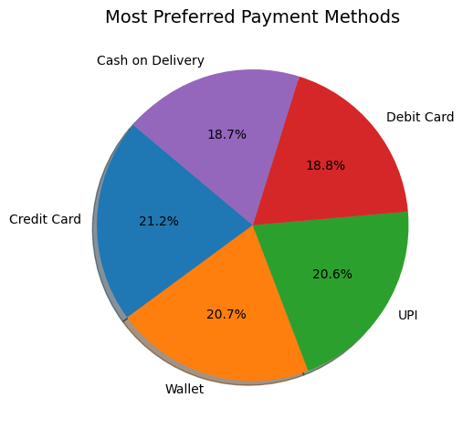
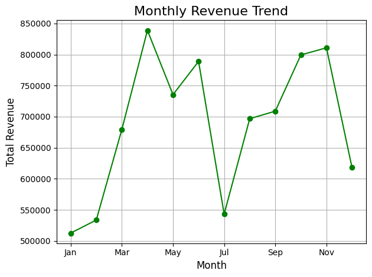
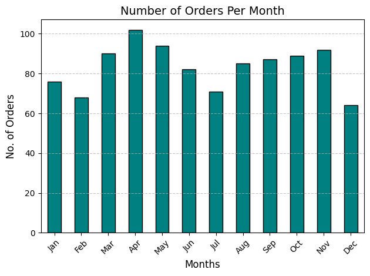

# 🛒 E-Commerce Sales and Customer Insights Dashboard

This project presents a comprehensive analysis of an e-commerce dataset using Python and popular data analysis libraries. It includes data cleaning, exploration, and a wide range of visualizations to uncover key insights about sales performance, customer behavior, and product trends.

---

## 📌 Project Objectives

- Understand customer purchase behavior
- Identify top-selling products and popular categories
- Analyze preferred payment methods and demographic patterns
- Discover time-based sales trends
- Correlate key features for business strategy improvement

---

## 📂 Dataset Overview

The dataset is located in the `dataset` folder and contains order-level transactional data, including:
- `Order ID`, `Customer ID`, `Gender`, `Age`
- `Product ID`, `Product Category`, `Quantity`, `Price per Unit`
- `Order Date`, `Payment Method`, `City`, `Rating`, `Total Amount`


---

## 🧹 Data Cleaning and Preparation

Steps performed:

- Converted the `Date` column to datetime format
- Filled missing values appropriately
- Checked and converted data types
- Removed or handled outliers and irrelevant entries

---

## 📊 Exploratory Data Analysis (EDA)

Key insights and visualizations generated:

### 🔝 Top Performing Products

- Bar chart showing the **Top 10 most sold products** based on total quantity

### 💳 Payment Method Preferences

- Pie chart representing **most preferred payment methods**

**Visualization:**


### 📆 Monthly Revenue Trends

- Line graph depicting **total revenue by month** to identify seasonal trends

**Visualization:**


### 🧾 Orders per Month

- Line chart showing **number of orders per month**

**Visualization:**


### 🧑‍🤝‍🧑 Customer Demographics

- Gender-wise and location-wise sales breakdown
- Female customers tend to make more high-value purchases
- Urban regions record higher purchase activity

### 🛍️ Product Category Performance

- Bar chart comparing **sales and total revenue by category**

---

## 📈 Business Insights

- **Sports** and **Books** are top-performing categories in terms of Total Revenue
- **Credit card** and **Wallet** are the most preferred payment methods
- **Sales peak in months** such as April, May, and November
- **Urban locations** contribute significantly to order volume
- **Other gender customers** slightly dominate high-revenue orders

---

## 🧰 Technologies Used

- **Python**
- **NumPy** for numerical operations
- **Pandas** for data manipulation
- **Matplotlib** for visualizations
- **Jupyter Notebook** for interactive analysis

---

## 🚀 How to Run

1. Clone the repository:

```bash
git clone https://github.com/iammarafzal/ecom-sales-analysis.git
cd ecom-sales-analysis
```

---

## 👨‍💻 Author

**Ammar Afzal**  
🎓 BS Computer Science | Python & Data Science Enthusiast  
🔗 [LinkedIn](https://www.linkedin.com/in/ammar-afzal277)  
